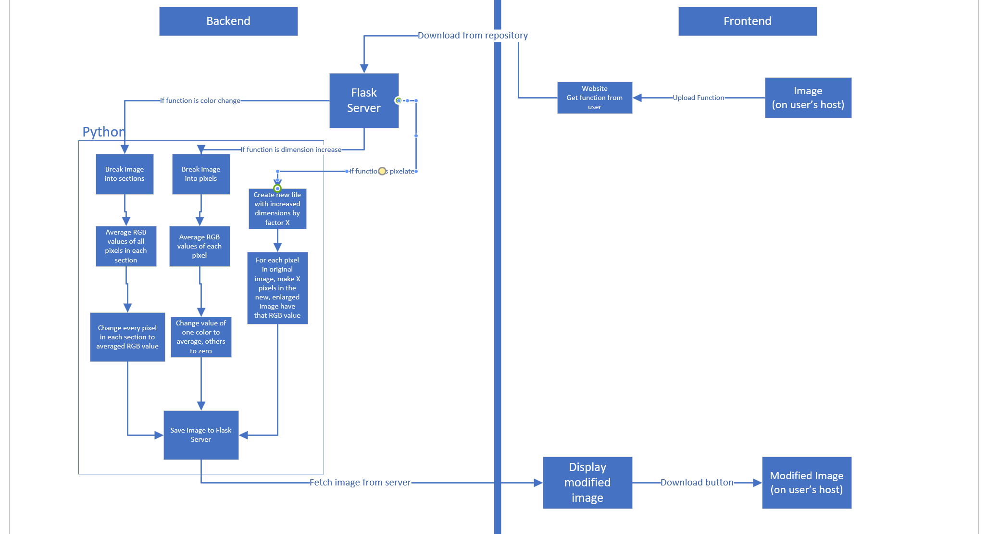

## Intro
After the data compression tech talk, our group became fascinated with the possibilities of manipulating images. We explored and did some research, and had the idea to match an image to an emoji. After doing further research, however, we quickly realized that that was extremely ambitious, and we should probably start with something simpler. We settled on image manipulation, such as pixelating and redscaling, inspired by the greyscale examplse project. We decided that if we had enough time after setting up uploading and downloading images on our website, we would try to attempt the emoji project.

## Roles
- Ian Wu: Scrum Master, Backend
- Trevor Huang: Frontend
- Jason Guan: Frontend
- Kyle Liang: Backend

## Use of the website
It’s always nice to take photos to capture the essence of a moment, but sometimes that gets bland. Our group took this into consideration when choosing our passion project. The goal is to be able to manipulate the image in various ways such as grayscale, red scale, blue scale, sizing up, and sizing down. Due to the fact that we may not know how long these actions will take, our goal is finish setting up a website, and upload and download functions first, then based on the time left whether we want to do the above mentioned or something more ambitious.

## Challenge
- If we finish with time to spare, maybe try using tensorflow to also identify the image that the user inputted
- Create an option to make a blurry image clearer

## Kyle
- Get the flask server up and running on AWS
- Work with Ian to create code that manipulates the images as expected
    - Take input from frontend as JSON
    - Develop an API that takes the image (converted to JSON) and manipulate the different pixels to get the intended result (e.g. pixelization, gray-scale, etc.) Take inspiration from the Data Compression Tech Talk.
    - Return the manipulated JSON back to frontend
- Get the back and front end to work together
    - Check the diagram for a more detailed description

## Ian
- Facilitate ideas between group members
    - Especially between frontend and backend
    - Manage the team meetings during class
    - Plan meeting times outside of class
- Help Kyle design the backend
    - Specifically, help work on the code that manipulates the image
    - Make sure that the frontend looks acceptable
- Research how to manipulate images

## Trevor
- Change the background theme to match Jason's design
- Work with Ian and Kyle to connect the backend and frontend
- Research how to manipulate images
- Design how the user should upload the image and how they can select options to manipulate images
- Maybe find a way for an image to be manipulated with many different options at once

## Jason
- Design the frontend
- Make the entire project look aesthetically pleasing
- Help Trevor design how the interface and how the user should upload their image
- Work on changing the theme of the website to match the planned design

## Basic Schedule

|   | M | T | W | Th | F |
|---|---|---|---|---|---|
| Frontend | Connect frontend to Jokes API (or one of the teacher APIs)| Continue to code with teacher API | Make the frontend look pretty | Continue with aesthetics  | Connect to backend’s API  |
| Backend  | Deploy to AWS  | Continue to Deploy  | Start coding the API for image manipulation  | Continue to code API  | Connect to frontend |

